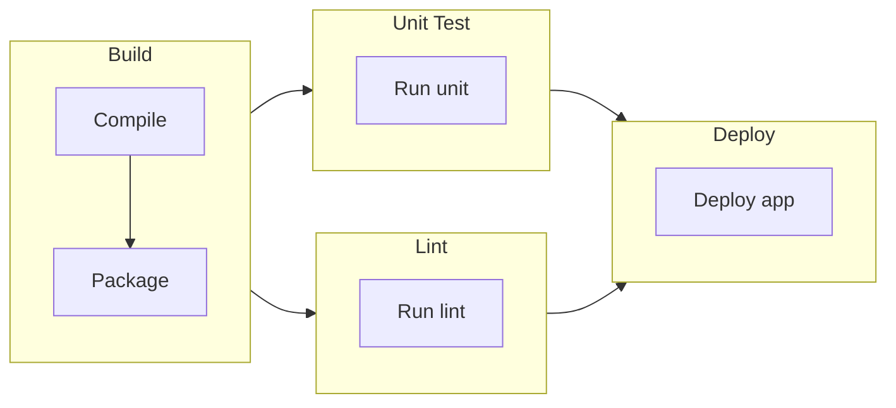

# CLIリファレンス

このページでは、すべてのコマンド、オプション、使用パターンを含む、Probeコマンドラインインターフェイスの完全なドキュメントを提供します。

## 基本的な使用法

Probeの呼び出し方は2つです。実行するワークフローファイルを渡すか、ファイルに対するサブコマンドを指定します。

```bash
probe [options] <workflow-file>
probe <subcommand> [options] <file>
```

## コマンド構文

実行時には必ず1つ以上のワークフローファイルを指定します。オプションはその前に置き、実行以外の処理を行う場合はファイルの代わりにサブコマンドを指定します。

### 基本コマンド

単一のワークフローファイルを実行：

```bash
probe workflow.yml
```

### ファイルマージ

設定マージでワークフローを実行：

```bash
probe base.yml,environment.yml,overrides.yml
```

ファイルは左から右に連結され、1つのYAMLドキュメントとして解析されます。複数のファイルで定義されたトップレベルのキーは最後のファイルの値になり、エントリ単位ではなくキーごと置き換わります。

### 位置引数

位置引数はワークフローのパスだけで、これは必須です。

#### `workflow-path`

**型:** String（必須）  
**説明:** ワークフローYAMLファイルのパス、またはマージ用のカンマ区切りファイルリスト

**例:**
```bash
# 単一ファイル
probe workflow.yml

# 複数ファイル（マージ）
probe base.yml,production.yml

# 相対パス
probe ./workflows/api-test.yml

# 絶対パス
probe /home/user/workflows/monitoring.yml
```

## コマンドラインオプション

オプションが変えるのは実行内容ではなく結果の伝え方です。どれだけ詳細に出力するか、どの形式で出力するか、実行時間を含めるかを指定します。

### `-v, --verbose`

**型:** ブールフラグ  
**デフォルト:** `false`  
**説明:** 詳細な実行情報を表示する詳細出力を有効化

**例:**
```bash
probe -v workflow.yml
probe --verbose workflow.yml
```

**詳細出力に含まれる内容:**
- ステップバイステップの実行詳細
- HTTPリクエスト/レスポンス情報
- テンプレート評価結果
- タイミング情報
- デバッグメッセージ

### `-h, --help`

**型:** ブールフラグ  
**説明:** コマンド使用法ヘルプを表示して終了

**例:**
```bash
probe -h
probe --help
```

### `--version`

**型:** ブールフラグ
**説明:** バージョン情報を表示して終了

**例:**
```bash
probe --version
```

**出力形式:**
```
Probe Version 1.2.3 (commit: abc1234)
```

### `--timing`

**型:** ブールフラグ  
**デフォルト:** `false`  
**説明:** ステップごとの時刻情報（開始時刻とレスポンスタイム）を表示

**例:**
```bash
probe --timing workflow.yml
```

### `--output`

**型:** String  
**値:** `auto`, `spinner`, `stream`  
**デフォルト:** `auto`  
**説明:** レポートの出力方法を選択します。`auto`は対話的な端末なら`spinner`、それ以外なら`stream`を選びます。`spinner`は進捗をその場で描き換え、`stream`は完了したものから順に書き出すため、CIのログやパイプに向いています。

値は環境変数`PROBE_OUTPUT`でも指定できます。優先順位はフラグ、環境変数、自動判定の順です。

**例:**
```bash
probe --output stream workflow.yml
probe --output=spinner workflow.yml
PROBE_OUTPUT=stream probe workflow.yml
```

### `--report`

**型:** String  
**値:** `format[=path]`をカンマで区切った並び。`format`は`json`、`junit`、`markdown`、`github-summary`のいずれか  
**デフォルト:** なし（レポートファイルは書き出さない）  
**説明:** すべてのジョブが終わったあと、実行結果をファイルに書き出します。端末に出るレポートは変わりません。

パスを省いた形式は、カレントディレクトリの既定のファイルに書き出します。パスの親ディレクトリは必要に応じて作成します。同じ形式は一度しか指定できません。既存のファイルは置き換え、そのパーミッションを保ちます。新しいファイルはumaskが許すパーミッションになります。カレントディレクトリの中を指すパスが、その外へ出ることはありません。ファイル自体がシンボリックリンクならリンクを置き換えてたどらず、途中のディレクトリが外を指すシンボリックリンクなら拒否します。そのため、チェックアウトしたプロジェクトがレポートを別の場所のファイルへ向けることはできません。カレントディレクトリの外を指すパス（絶対パスや`..`を含むパス）は、指定どおりの場所に書き出します。

| 形式 | 既定のファイル | 内容 |
|---|---|---|
| `json` | `probe-report.json` | 実行全体。状態、所要時間、ジョブとステップの状態ごとの集計、そして各ステップの`test`、OpenAPIドキュメントでレスポンスを対応付けた先（`contract`）、失敗した場合はその理由とリクエスト・レスポンス |
| `junit` | `probe-junit.xml` | ジョブごとに`testsuite`、ステップごとに`testcase`を持つJUnit XML。テスト結果を読めるCI向け |
| `markdown` | `probe-report.md` | 要約の1行、ジョブの表、失敗したステップごとの節 |
| `github-summary` | `$GITHUB_STEP_SUMMARY` | `markdown`と同じページを、GitHub Actionsのジョブサマリーに追記 |

`github-summary`は上書きせずに追記します。先行するステップやほかのツールも同じサマリーに書き込むためです。`GITHUB_STEP_SUMMARY`が設定されておらずパスも指定されていない場合、つまりGitHub Actionsの外では、警告を出して書き出しを飛ばし、終了コードは変えません。同じコマンドラインをCIでも手元でも使えます。GitHubが受け付けるサマリーは1ステップあたり1MiBまでです。ページがそれを超えそうな場合はリクエストとレスポンスを省き、それでも大きすぎる場合は失敗したステップの区切りで打ち切り、その旨を書き添えます。先行するステップの書き込みで空きがまったく残っていない場合は、何も書かずに警告を出します。書き込んでしまうと上限を超え、先行するステップが書いた内容まで失われるためです。パスを明示した場合は、ほかの形式と同じく親ディレクトリを作成します。サマリーは置き換えずに追記するため、明示したパスも同じようにカレントディレクトリの中にとどめ、外へ出るシンボリックリンクは拒否します。`GITHUB_STEP_SUMMARY`のパスはそのまま使います。

ステップの状態は`passed`、`failed`、`skipped`、そして`test`がなく、OpenAPIドキュメントなどほかに検証するものもないまま実行された場合の`untested`のいずれかです。失敗したステップには次のどれかの理由が記録されます。

| 種類 | 意味 | JUnitの要素 |
|---|---|---|
| `assertion` | `test`式がfalseになった | `<failure>` |
| `test_error` | `test`式を評価できなかった | `<error>` |
| `test_type` | `test`式の結果が真偽値ではなかった | `<error>` |
| `action` | 接続の拒否など、アクションがエラーを返した | `<error>` |
| `template` | ステップの`with`、`vars`、`name`のテンプレートを評価できず、アクションを実行しなかった | `<error>` |
| `contract_response` | OpenAPIドキュメントなど、アクションが照合した契約にレスポンスが違反した | `<failure>` |
| `refused` | `--read-only`など、実行のガードがステップの操作を拒否した | `<error>` |
| `contract_request` | アクションが照合した契約にリクエストが違反した。OpenAPIドキュメントが許さないものをワークフローが送った | `<error>` |

`repeat`付きのジョブのステップは、1回でも失敗すれば失敗として扱い、成功した回数と、最初に失敗した回の理由を記録します。アクションがレスポンスに`dump: false`を設定した場合は、端末と同じくレポートにもリクエストとレスポンスを含めません。

値は環境変数`PROBE_REPORT`でも指定でき、フラグのほうが優先されます。書き出せないレポートファイルがあっても残りは書き出し、Probeは終了ステータス2で終わります。

**例:**
```bash
probe --report junit workflow.yml
probe --report json=out/report.json,junit=out/junit.xml,markdown=out/summary.md workflow.yml
PROBE_REPORT=markdown probe workflow.yml
```

### `--read-only`

**型:** Boolean  
**デフォルト:** false  
**説明:** 書き込みになりうる操作を拒否します。コーディングエージェントが書いたワークフローなどを、変更してはならないシステムに対して実行するときに使います。

`--read-only`、`--allow-host`、`--allow-action`の3つで、実行のガードを構成します。ガードはProbeを実行する人が指定するもので、ワークフローの側からは緩められません。何を許可するかは各アクションが判定し、Probeは、実行にかかっているガードの種類をすべて守ると申告したアクションだけをガードの下で実行します。拒否されたステップは種類`refused`で失敗し、終了ステータスは2です。各アクションが何を拒否するかと、外部アクションが守るガードをどう申告するかは、[ガード](/ja/guide/concepts/guard)を参照してください。

`--read-only=false`で無効にできます。値は環境変数`PROBE_READ_ONLY`（`true`または`1`）でも指定でき、フラグを指定すれば常にフラグのほうが優先されます。

**例:**
```bash
probe --read-only --allow-host api.staging.example.com workflow.yml
```

### `--allow-host`

**型:** String  
**値:** ホストのカンマ区切りのリスト。名前かアドレスで、`localhost:8080`のようにポートを付けるか、付けずに任意のポートを許可するか、`*.example.com`で`example.com`の下の名前を指定します  
**デフォルト:** なし（任意のホスト）  
**説明:** 指定したホスト以外への接続を拒否します。名前は大文字と小文字を区別せずに比較します。どのアクションがこれを守るかは[ガード](/ja/guide/concepts/guard)を参照してください。

値は環境変数`PROBE_ALLOW_HOSTS`でも指定できます。フラグを指定すれば常にフラグのほうが優先されるため、`--allow-host=`は任意のホストを許可します。

### `--allow-action`

**型:** String  
**値:** アクション名のカンマ区切りのリスト。ステップが`uses`に書く名前です  
**デフォルト:** なし  
**説明:** ガードを守ると申告していないアクションでも、`--read-only`や`--allow-host`の下で実行します。Probeを実行する人が信頼する準備用の`shell`などに使います。指定したアクションにもガードは伝えますが、アクションはそのまま実行されます。

値は環境変数`PROBE_ALLOW_ACTIONS`でも指定できます。フラグを指定すれば常にフラグのほうが優先されるため、`--allow-action=`はどのアクションも許可しません。

**例:**
```bash
probe --read-only --allow-action shell workflow.yml
```

## サブコマンド

サブコマンドを指定すると、ワークフローの実行の代わりに別の処理を行います。`gen`は雛形のワークフローを生成し、`dag`はワークフローが表す依存関係のグラフを出力し、`check`はワークフローを実行せずに誤りや弱点を見つけ、`coverage`は実行がOpenAPIドキュメントのどこまでを検証したかを示し、`guide`はこのドキュメントを出力し、`skill`はコーディングエージェントがProbeを使えるように準備します。

### `gen`

OpenAPI仕様からprobeワークフローYAMLを生成します。

**使い方:**
```bash
probe gen <openapi-file>
```

**例:**
```bash
probe gen petstore.yml
```

### `dag`

ワークフローを実行せずにジョブ依存関係グラフを表示します。デフォルトではASCIIアートで出力します。`--mermaid`を指定するとMermaidフローチャート形式で出力します。

**使い方:**
```bash
probe dag <workflow-file>
probe dag --mermaid <workflow-file>
```

**オプション:**

| オプション | 説明 |
|--------|-------------|
| `--mermaid` | ASCIIアートの代わりにMermaidフローチャート形式で出力 |

**ASCII出力例:**
```
╭───────────────────────╮
│         Setup         │
├───────────────────────┤
│ ○ Initialize          │
╰───────────┬───────────╯
            │
            │
            ↓
╭───────────────────────╮
│         Build         │
├───────────────────────┤
│ ○ Compile             │
│ ○ Package             │
╰───────────┬───────────╯
            │
            ├──────────────────────────┐
            ↓                          ↓
╭───────────────────────╮  ╭───────────────────────╮
│        Test A         │  │        Test B         │
├───────────────────────┤  ├───────────────────────┤
│ ○ Run tests           │  │ ○ Run tests           │
╰───────────────────────╯  ╰───────────────────────╯
```

**Mermaid出力例 (`--mermaid`):**

```mermaid
flowchart LR
    subgraph build["Build"]
        direction TB
        build_step0["Compile"]
        build_step1["Package"]
        build_step0 --> build_step1
    end
    subgraph unit_test["Unit Test"]
        direction TB
        unit_test_step0["Run unit"]
    end
    subgraph lint["Lint"]
        direction TB
        lint_step0["Run lint"]
    end
    subgraph deploy["Deploy"]
        direction TB
        deploy_step0["Deploy app"]
    end

    build --> unit_test
    build --> lint
    unit_test --> deploy
    lint --> deploy
```

以下の用途に便利です：
- 実行前にワークフロー構造を可視化
- ジョブ依存関係とそのステップの理解
- ジョブ依存関係の設定をデバッグ
- ドキュメントやダイアグラムの生成
- Markdownファイルへの埋め込み

### `check`

ワークフローを実行せずに、誤りや弱点を見つけます。人やコーディングエージェントが書いたワークフローを、テスト対象のシステムに届く前に確かめられます。実行時と同じく複数のファイルを読み合わせる場合は、カンマ区切りで1つの引数として渡します。

**使い方:**
```bash
probe check workflow.yml
probe check base.yml,staging.yml
```

**出力例:**
```
workflow.yml:10: error: job 0 "Users", step 0 "Log in": unknown key "tset"; did you mean "test"?
workflow.yml:14: error: job 0 "Users", step 1 "Read": unknown action "htp"; did you mean "http"?
workflow.yml:18: error: job 0 "Users", step 1 "Read": with: outputs.login.tokn is not published: step "login" publishes token
workflow.yml:39: warning: job 1 "Other", step 0 "Reads users": with: outputs.login.token may not be published yet: job "Other" does not need job "Users", whose step publishes it

3 errors, 1 warning
```

**エラー**として報告するもの:

- ワークフロー、ジョブ、ステップ、`retry`、`repeat`が受け付けないキー。実行時は無視されます。後に読むファイルのためにYAMLのアンカーを持つキーは対象外です
- `name`がない、IDが重複しているなど、実行時に読み込みを拒否されるもの
- 組み込みでも外部でもないアクション、解析できない外部アクションの指定
- ステップの`with`やジョブの`defaults`にある、組み込みアクションが受け付けないキー。アクションはそれを無視します（`body`のつもりの`bdoy`など）。また、どのアクションの名前でもない`defaults`。どのステップにも効きません。確かめるのは直下のキーだけで、`headers`のようなマップの中のキーは確かめません。テンプレートを含むキー、外部アクション、どんなキーも受け付ける`hello`は対象外です
- どのジョブも指していない`needs`、循環する`needs`
- 実行時に拒否されるステップID
- 解析できない式（`test`、`skipif`、`outputs`）とテンプレート（`name`、`with`、`vars`、`echo`）
- どのステップも公開していない出力、そのステップが公開していない出力、そのステップが公開する前に読む出力（同じジョブの前のステップから読む場合など）の参照

**警告**として報告するもの:

- 読む側のジョブが直接にも間接にも`needs`で指定していないジョブの出力の参照。まだ公開されていないかもしれません
- 何も検証していないステップ。`test`がなく、httpアクションの`openapi`やgrpcアクションの`proto`のように契約との照合をアクションに求めてもいないもの
- `1 == 1`のように何も読まない`test`。ステップが何をしても結果が変わりません

エラーが見つかれば終了ステータスは2、警告だけか何も見つからなければ0です。

### `coverage`

実行が`--report json`で書き出したレポートから、OpenAPIドキュメントのオペレーションとレスポンス、または`.proto`ファイルのメソッドのうち、どれをステップが検証したかを示します。httpアクションが`openapi`でレスポンスをドキュメントと照合したステップと、grpcアクションが`proto`で呼び出しをファイルと照合したステップを、成功したかどうかにかかわらず数えます。

**使い方:**
```bash
probe --report json workflow.yml
probe coverage openapi.yml probe-report.json
probe coverage proto/users.proto probe-report.json
```

**出力例:**
```
Coverage of openapi.yml

✓ GET /users/{id} (2 steps)
    ✓ 200 (2 steps)
    - 404
- DELETE /users/{id}
    - 204
✓ GET /items (1 step)
    ✓ default (1 step)

Operations: 2 of 3 checked (66.7%)
Responses:  2 of 4 checked (50.0%)
```

ドキュメントが宣言する各オペレーションを、宣言するレスポンス（`200`、`2XX`、`default`など）とともに一覧にします。ステップのレスポンスを対応付けたものには`✓`、どのステップも対応付けなかったものには`-`を付けます。オペレーションが宣言していないステータスコードのステップは、オペレーションだけに数えます。ステップは、指定したドキュメントを同じパスで指しているときに数えます。`./openapi.yml`のように書き方が違っても同じパスなら数えます。どのステップも指定したドキュメントを指していないレポートはエラーになり、ステップが指しているドキュメントを一覧で示します。`.proto`で終わるファイルは、grpcアクションの契約として扱います。インポートは解決せずにそのファイルだけを読み、宣言している各サービスの各メソッドを`users.v1.UserService/GetUser`のように一覧にします。`.proto`ファイルはメソッドが返すステータスを宣言しないため、網羅度はメソッドだけで示し、レスポンスの行は出しません。ファイルは`proto.files`と同じパスで指定します。

網羅の度合いにかかわらず終了ステータスは0で、ドキュメントかレポートを読めない場合は2です。

### `guide`

リファレンスとコンセプトのドキュメントを、1ページずつMarkdownで出力します。ページはバイナリに組み込まれているため、オフラインでも使え、実行中のProbeのバージョンに対応した内容です。コーディングエージェントは、ワークフローを書いたり直したりする前にこれを読めます。

**使い方:**
```bash
probe guide            # トピックの一覧
probe guide <topic>    # 1ページを出力
```

| トピック | ページ |
|---|---|
| `yaml`、`cli`、`functions`、`env`、`actions` | YAMLの設定、CLI、組み込み関数、環境変数、アクションの概要 |
| `http`や`shell`などのアクション名 | そのアクションのリファレンス。`actions/http`の形でも指定可能 |
| `concepts/expressions`や`concepts/testing`などの`concepts/<name>` | コンセプトのガイド |

**例:**
```bash
probe guide http | less
probe guide concepts/expressions > expressions.md
```

未知のトピックを指定すると終了ステータス2で終わります。

### `skill`

Claude Codeなどのコーディングエージェントに、Probeのワークフローの書き方、実行の仕方、失敗の調べ方を教えるエージェントスキルを出力またはインストールします。スキルは、YAMLを書く前に`probe guide`を読むこと、間違えやすい規則、そして失敗した実行を終了コードとレポートから読み解く方法をエージェントに伝えます。

**使い方:**
```bash
probe skill                    # SKILL.mdを出力
probe skill install            # .claude/skills/probe/SKILL.mdに書き出す
probe skill install <dir>      # <dir>/SKILL.mdに書き出す
```

`install`はディレクトリを作成し、既存の`SKILL.md`を置き換えます。Probeを更新したあとにもう一度実行すれば、スキルも最新になります。レポートファイルと同じく、`SKILL.md`や`.claude`などのディレクトリにあるシンボリックリンクによって、プロジェクトの外に書き出させることはできません。別の場所からスキルを読むエージェントには、`probe skill install .agents/skills/probe`のようにそのディレクトリを指定します。リポジトリからスキルをインストールするツール向けに、同じファイルをリポジトリの`skills/probe/SKILL.md`にも置いています。

## 環境変数

以下の環境変数がProbeの動作に影響します。

### `PROBE_OUTPUT`

**型:** String  
**値:** `auto`, `spinner`, `stream`  
**デフォルト:** `auto`  
**説明:** レポートの出力方法。`--output`と同じ値を取り、フラグが指定された場合はそちらが優先されます。

```bash
export PROBE_OUTPUT=stream
probe workflow.yml
```

### `PROBE_REPORT`

**型:** String  
**値:** `format[=path]`をカンマで区切った並び  
**デフォルト:** なし  
**説明:** 書き出すレポートファイル。`--report`と同じ値を取り、フラグが指定された場合はそちらが優先されます。

```bash
export PROBE_REPORT=junit=out/junit.xml
probe workflow.yml
```

### `PROBE_READ_ONLY`、`PROBE_ALLOW_HOSTS`、`PROBE_ALLOW_ACTIONS`

**説明:** 実行のガードです。それぞれ`--read-only`、`--allow-host`、`--allow-action`と同じです。`PROBE_READ_ONLY`は、`true`か`1`で書き込みを拒否し、`false`、`0`、空では拒否しません。いずれもフラグのほうが優先されます。

```bash
export PROBE_READ_ONLY=true
export PROBE_ALLOW_HOSTS=api.staging.example.com
probe workflow.yml
```

### `PROBE_MAX_REPEAT_COUNT`

**型:** Integer  
**デフォルト:** `10000`  
**説明:** ステップの`repeat.count`の上限。これを超える指定をしたワークフローはエラーになります。

```bash
export PROBE_MAX_REPEAT_COUNT=50000
probe load-test.yml
```

### `PROBE_MAX_ATTEMPTS`

**型:** Integer  
**デフォルト:** `10000`  
**説明:** ステップのリトライ`max_attempts`の上限。

```bash
export PROBE_MAX_ATTEMPTS=100
probe workflow.yml
```

### `FORCE_COLOR`

**型:** String  
**値:** `1`  
**説明:** 標準出力が端末でない場合でも色付き出力を強制します。CIのログで色を残したいときに使います。

```bash
FORCE_COLOR=1 probe workflow.yml
```

これら以外の環境変数は、ワークフローの`vars`から名前そのままで参照できます。詳しくは[環境変数](/ja/reference/environment-variables)を参照してください。

## 使用例

以下では1つのファイルを実行する例から始めて、設定のマージ、コンテナ、CIでの実行、定期的な監視までを示します。

### 基本的なワークフロー実行

実行に必要なのはファイルだけです。`-v`を付けると各ステップの詳細が出力されます。

```bash
# 簡単なヘルスチェックを実行
probe health-check.yml

# 詳細出力で実行
probe -v health-check.yml
```

### 環境固有の実行

カンマに続けて2つ目のファイルを指定すると、1つ目に上書きマージされます。1つのワークフローで環境を切り替えるにはこの方法を使います。

```bash
# 開発環境
probe workflow.yml,dev.yml

# ステージング環境
probe workflow.yml,staging.yml

# プロダクション環境
probe workflow.yml,prod.yml
```

### 複雑な設定マージ

ファイルは3つ以上でもマージでき、後に書いたものが前のものを上書きします。

```bash
# 複数の設定をレイヤー化
probe base.yml,region-us.yml,environment-prod.yml,team-overrides.yml
```

### CI/CD統合

終了コードに結果が反映されるため、デプロイ用のスクリプトは実行が失敗した時点で止められます。

```bash
#!/bin/bash
# deployment-test.sh

set -e

echo "Running deployment validation..."
probe deployment-validation.yml,${ENVIRONMENT}.yml

echo "Running smoke tests..."
probe smoke-tests.yml,${ENVIRONMENT}.yml

echo "All tests passed!"
```

### スケジュール実行

同じワークフローを定期的に実行すれば監視になります。cronでもsystemdのタイマーでも構いません。

```bash
# 定期監視用のcrontabエントリ
# 5分毎に実行
*/5 * * * * /usr/local/bin/probe /opt/workflows/monitoring.yml >> /var/log/probe.log 2>&1

# systemdタイマーユニット
[Unit]
Description=Probe Monitoring
Requires=probe-monitoring.timer

[Service]
Type=oneshot
ExecStart=/usr/local/bin/probe /opt/workflows/monitoring.yml
User=probe
Group=probe

[Install]
WantedBy=multi-user.target
```

## 終了コード

終了コードは、失敗したかどうかだけでなく、何を調べるべきかを示します。呼び出し側は、テスト対象のバグ、到達できない接続先、ワークフローの誤りを区別できます。

| 終了コード | 意味 | 説明 |
|-----------|---------|-------------|
| `0` | 成功 | すべてのジョブが完了し、すべてのテストが成功 |
| `1` | テストの失敗 | `test`がfalseになった、評価できなかった、または真偽値にならなかった。あるいはステップに必要なテンプレートを評価できなかった、またはhttpアクションが照合したOpenAPIドキュメントにリクエストかレスポンスが違反した |
| `2` | 設定の誤り | ワークフローやコマンドラインが誤っている。ファイルが無い、YAMLが不正、`needs`に未知のジョブ、不正なステップID、未知のフラグやレポート形式など。実行のガードがステップを拒否した場合と、レポートファイルを書き出せなかった場合も`2` |
| `3` | アクションのエラー | 接続の拒否やタイムアウトなど、アクションがエラーを返したため、テストを確かめられなかった |

1回の実行で複数の種類の失敗が起きた場合は、`2`、`3`、`1`の順で最初に当てはまるものを返します。接続先が落ちていると、それに対するテストも失敗することが多いため、`1`より`3`を優先します。

`--help`は使い方を表示して`1`で終わります。

### 終了コードの例

呼び出し側のスクリプトは終了コードで処理を分岐します。

```bash
# 何が起きたかで分岐する
probe workflow.yml
case $? in
  0) echo "Workflow succeeded" ;;
  1) echo "A test failed: look at the system under test" ;;
  2) echo "The workflow or command line is wrong" ;;
  3) echo "An action failed: check that the targets are reachable" ;;
esac

# CI/CDパイプラインで使用
probe integration-tests.yml || exit 1
```

## パフォーマンスとリソース使用量

Probeは単一のバイナリで、起動時に用意するランタイムがありません。実行時間の大半はワークフローが待つ対象によって決まります。

### メモリ使用量

- **ベースメモリ:** Probeランタイムで約10MB
- **ワークフローあたり:** 複雑さに応じて約1-5MB
- **アクションあたり:** レスポンスサイズに応じて約0.1-1MB

### 実行タイミング

`time`では全体の所要時間が、`--timing`ではステップごとの内訳がわかります。

```bash
# ワークフロー実行時間を計測
time probe workflow.yml

# 詳細モードで詳細なタイミング
probe -v workflow.yml 2>&1 | grep "Execution time"
```

### 並行実行

Probeは可能な場合ジョブを並列実行します：

```bash
# 依存関係のないジョブは同時実行される
# 最大同時実行数は通常システムリソースにより制限される
# 詳細モードで実行パターンを確認
probe -v parallel-workflow.yml
```

## トラブルシューティングコマンド

期待どおりに動かないときは、まずProbeが実際に読み込んだ内容を確認します。以下ではその確認方法と、よく遭遇する問題を示します。

### デバッグ情報

オプションを組み合わせると、実行時に得られる情報をすべて出力できます。`--version`では使用中のバイナリを特定できます。

```bash
# 最大限の情報を出す
probe -v --timing workflow.yml

# バージョンとコミットを確認
probe --version

# 実行せずにジョブの依存関係を確認
probe dag workflow.yml
```

### よくある問題

**ファイルが見つからない:**
```bash
probe: error: workflow file 'missing.yml' not found
# ファイルパスと権限をチェック
ls -la missing.yml
```

**権限拒否:**
```bash
probe: error: permission denied reading 'workflow.yml'
# ファイル権限を修正
chmod 644 workflow.yml
```

**YAML構文エラー:**
```bash
probe: error: YAML syntax error at line 15
# YAML構文を検証
yaml-validator workflow.yml
```

## 統合例

Probeは単一のバイナリで、終了コードで結果を返します。そのためCIからの実行は1ステップで済みます。以下では3つのCIでの書き方を示します。

### GitHub Actions

バイナリの取得を1ステップ、ワークフローの実行を次のステップで行います。

```yaml
name: Probe Tests
on: [push, pull_request]

jobs:
  test:
    runs-on: ubuntu-latest
    steps:
      - uses: actions/checkout@v3
      
      - name: Install Probe
        run: |
          curl -L https://github.com/linyows/probe/releases/latest/download/probe_linux_x86_64.tar.gz | tar -xz probe
          chmod +x probe
          sudo mv probe /usr/local/bin/
      
      - name: Run Tests
        env:
          API_TOKEN: ${{ secrets.API_TOKEN }}
        run: probe --report github-summary workflow.yml,${GITHUB_REF##*/}.yml
```

`--report github-summary`を付けると、失敗したステップを含む結果が実行のサマリーページに表示されます。

### GitLab CI

同じ2つの手順を1つのジョブ定義に収められます。

```yaml
stages:
  - test

probe-test:
  stage: test
  image: alpine:latest
  before_script:
    - apk add --no-cache curl
    - curl -L https://github.com/linyows/probe/releases/latest/download/probe_linux_x86_64.tar.gz | tar -xz -C /usr/local/bin probe
    - chmod +x /usr/local/bin/probe
  script:
    - probe workflow.yml,$CI_ENVIRONMENT_NAME.yml
  variables:
    API_TOKEN: $API_TOKEN
```

### Jenkinsパイプライン

認証情報はJenkinsのクレデンシャルストアから取得し、環境変数としてProbeに渡します。

```groovy
pipeline {
    agent any
    
    environment {
        API_TOKEN = credentials('api-token')
        PROBE_OUTPUT = 'stream'
    }
    
    stages {
        stage('Install Probe') {
            steps {
                sh '''
                    curl -L https://github.com/linyows/probe/releases/latest/download/probe_linux_x86_64.tar.gz | tar -xz probe
                    chmod +x probe
                    sudo mv probe /usr/local/bin/
                '''
            }
        }
        
        stage('Run Tests') {
            steps {
                sh 'probe workflow.yml,${BRANCH_NAME}.yml'
            }
        }
    }
    
    post {
        always {
            archiveArtifacts artifacts: '*.log', allowEmptyArchive: true
        }
    }
}
```

## 高度な使用パターン

以下は1つのファイルを実行するのではなく、多数のワークフローや環境にまたがってProbeを動かす場合のパターンです。

### 設定テンプレート

ファイルのパス自体を環境変数から組み立てれば、環境が変わってもコマンドラインは同じままです。

```bash
# ファイルパスで環境変数を使用
export ENV=production
probe workflow.yml,configs/${ENV}.yml

# 動的ファイル選択
WORKFLOW_FILE=$([ "$ENV" = "prod" ] && echo "prod-workflow.yml" || echo "dev-workflow.yml")
probe $WORKFLOW_FILE
```

### バッチ実行

ディレクトリをループすれば全ワークフローを実行し、失敗したものを記録できます。

```bash
# 複数のワークフローを実行
for workflow in workflows/*.yml; do
  echo "Running $workflow..."
  probe "$workflow" || echo "Failed: $workflow"
done

# 並列実行
find workflows/ -name "*.yml" | xargs -P 4 -I {} probe {}
```

### 監視統合

監視システムが必要とするのは終了コードです。そのため、呼び出し側のスクリプトから結果を転送できます。

```bash
# 監視システムとの統合
probe monitoring.yml
RESULT=$?

if [ $RESULT -ne 0 ]; then
  # 監視システムにアラートを送信
  curl -X POST https://monitoring.example.com/alert \
    -H "Content-Type: application/json" \
    -d '{"message": "Probe workflow failed", "exit_code": '$RESULT'}'
fi
```

## 関連項目

- **[YAML設定](/ja/reference/yaml-configuration)** - 完全なYAML構文リファレンス
- **[アクションリファレンス](/ja/reference/actions/variables)** - 組み込みアクションとパラメータ
- **[環境変数](/ja/reference/environment-variables)** - サポートされているすべての環境変数
- **[ハウツー](/ja/guide/how-tos/api-testing)** - 実用的な使用例
- **[エラーハンドリング戦略](/ja/guide/how-tos/error-handling-strategies)** - よくある問題と解決策
