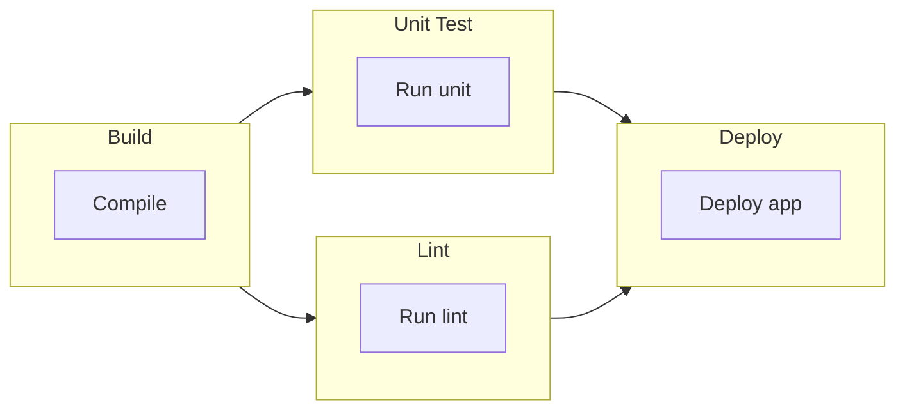

# CLI Reference

This page provides complete documentation for the Probe command-line interface, including all commands, options, and usage patterns.

## Basic Usage

```bash
probe [options] <workflow-file>
probe <subcommand> [options] <file>
```

## Command Syntax

### Basic Command

Execute a single workflow file:

```bash
probe workflow.yml
```

### File Merging

Execute workflows with configuration merging:

```bash
probe base.yml,environment.yml,overrides.yml
```

The files are concatenated from left to right into a single YAML document. A top-level key defined in more than one file takes the value from the last file, and the whole key is replaced rather than merged entry by entry.

### Positional Arguments

#### `workflow-path`

**Type:** String (required)  
**Description:** Path to the workflow YAML file, or comma-separated list of files for merging

**Examples:**
```bash
# Single file
probe workflow.yml

# Multiple files (merging)
probe base.yml,production.yml

# Relative paths
probe ./workflows/api-test.yml

# Absolute paths
probe /home/user/workflows/monitoring.yml
```

## Command-Line Options

### `-v, --verbose`

**Type:** Boolean flag  
**Default:** `false`  
**Description:** Enable verbose output showing detailed execution information

**Example:**
```bash
probe -v workflow.yml
probe --verbose workflow.yml
```

**Verbose Output Includes:**
- Step-by-step execution details
- HTTP request/response information
- Template evaluation results
- Timing information
- Debug messages

### `-h, --help`

**Type:** Boolean flag  
**Description:** Show command usage help and exit

**Example:**
```bash
probe -h
probe --help
```

### `--version`

**Type:** Boolean flag
**Description:** Show version information and exit

**Example:**
```bash
probe --version
```

**Output Format:**
```
Probe Version 1.2.3 (commit: abc1234)
```

### `--timing`

**Type:** Boolean flag  
**Default:** `false`  
**Description:** Show timing information (start time and response time) for each step

**Example:**
```bash
probe --timing workflow.yml
```

### `--output`

**Type:** String  
**Values:** `auto`, `spinner`, `stream`  
**Default:** `auto`  
**Description:** Select how the report is rendered. `auto` picks `spinner` on an interactive terminal and `stream` otherwise. `spinner` redraws progress in place, while `stream` writes each result as it completes, which suits CI logs and pipes.

The value can also come from the `PROBE_OUTPUT` environment variable. The flag wins over the environment variable, which in turn wins over auto detection.

**Example:**
```bash
probe --output stream workflow.yml
probe --output=spinner workflow.yml
PROBE_OUTPUT=stream probe workflow.yml
```

## Subcommands

### `gen`

Generate probe workflow YAML from an OpenAPI specification.

**Usage:**
```bash
probe gen <openapi-file>
```

**Example:**
```bash
probe gen petstore.yml
```

### `dag`

Display job dependency graph without executing the workflow. By default, outputs ASCII art. Use `--mermaid` to output in Mermaid flowchart format.

**Usage:**
```bash
probe dag <workflow-file>
probe dag --mermaid <workflow-file>
```

**Options:**

| Option | Description |
|--------|-------------|
| `--mermaid` | Output in Mermaid flowchart format instead of ASCII art |

**ASCII Output Example:**
```
╭───────────────────────╮
│         Setup         │
├───────────────────────┤
│ ○ Initialize          │
╰───────────┬───────────╯
            │
            │
            ↓
╭───────────────────────╮
│         Build         │
├───────────────────────┤
│ ○ Compile             │
│ ○ Package             │
╰───────────┬───────────╯
            │
            ├──────────────────────────┐
            ↓                          ↓
╭───────────────────────╮  ╭───────────────────────╮
│        Test A         │  │        Test B         │
├───────────────────────┤  ├───────────────────────┤
│ ○ Run tests           │  │ ○ Run tests           │
╰───────────────────────╯  ╰───────────────────────╯
```

**Mermaid Output Example (`--mermaid`):**


This is useful for:
- Visualizing workflow structure before execution
- Understanding job dependencies and their steps
- Debugging job dependency configurations
- Generating documentation with rendered diagrams
- Embedding in Markdown files for automatic rendering

## Environment Variables

The following environment variables affect Probe's behavior:

### `PROBE_OUTPUT`

**Type:** String  
**Values:** `auto`, `spinner`, `stream`  
**Default:** `auto`  
**Description:** Report output mode, same as `--output`. The flag takes precedence.

```bash
export PROBE_OUTPUT=stream
probe workflow.yml
```

### `PROBE_MAX_REPEAT_COUNT`

**Type:** Integer  
**Default:** `10000`  
**Description:** Upper limit for a step's `repeat.count`. A workflow that asks for more is rejected.

```bash
export PROBE_MAX_REPEAT_COUNT=50000
probe load-test.yml
```

### `PROBE_MAX_ATTEMPTS`

**Type:** Integer  
**Default:** `10000`  
**Description:** Upper limit for a step's retry `max_attempts`.

```bash
export PROBE_MAX_ATTEMPTS=100
probe workflow.yml
```

### `FORCE_COLOR`

**Type:** String  
**Values:** `1`  
**Description:** Force colored output even when standard output is not a terminal, such as in a CI log.

```bash
FORCE_COLOR=1 probe workflow.yml
```

Workflows read any other environment variable through `vars`, so `API_URL`, `ENVIRONMENT` and the like are yours to define. See [Environment Variables](/reference/environment-variables) for that side of things.

## Usage Examples

### Basic Workflow Execution

```bash
# Run a simple health check
probe health-check.yml

# Run with verbose output
probe -v health-check.yml
```

### Environment-Specific Execution

```bash
# Development environment
probe workflow.yml,dev.yml

# Staging environment
probe workflow.yml,staging.yml

# Production environment
probe workflow.yml,prod.yml
```

### Complex Configuration Merging

```bash
# Layer multiple configurations
probe base.yml,region-us.yml,environment-prod.yml,team-overrides.yml
```

### CI/CD Integration

```bash
#!/bin/bash
# deployment-test.sh

set -e

echo "Running deployment validation..."
probe deployment-validation.yml,${ENVIRONMENT}.yml

echo "Running smoke tests..."
probe smoke-tests.yml,${ENVIRONMENT}.yml

echo "All tests passed!"
```

### Docker Integration

```bash
# Run Probe in Docker container
docker run --rm -v $(pwd):/workspace \
  -e API_TOKEN=$API_TOKEN \
  probe:latest workflow.yml

# Docker Compose service
version: '3.8'
services:
  probe:
    image: probe:latest
    volumes:
      - ./workflows:/workflows
    environment:
      - API_TOKEN
      - ENVIRONMENT=production
    command: /workflows/monitoring.yml,/workflows/production.yml
```

### Scheduled Execution

```bash
# Crontab entry for regular monitoring
# Run every 5 minutes
*/5 * * * * /usr/local/bin/probe /opt/workflows/monitoring.yml >> /var/log/probe.log 2>&1

# Systemd timer unit
[Unit]
Description=Probe Monitoring
Requires=probe-monitoring.timer

[Service]
Type=oneshot
ExecStart=/usr/local/bin/probe /opt/workflows/monitoring.yml
User=probe
Group=probe

[Install]
WantedBy=multi-user.target
```

## Exit Codes

Probe reports the outcome of a run with two exit codes:

| Exit Code | Meaning | Description |
|-----------|---------|-------------|
| `0` | Success | Every job completed and every test passed |
| `1` | Failure | A test failed, an action returned an error, or the workflow could not be loaded (missing file, invalid YAML, unknown flag) |

### Exit Code Examples

```bash
# Check exit code in scripts
probe workflow.yml
if [ $? -eq 0 ]; then
  echo "Workflow succeeded"
else
  echo "Workflow failed with exit code $?"
fi

# Use in CI/CD pipelines
probe integration-tests.yml || exit 1
```

## Performance and Resource Usage

### Memory Usage

- **Base memory:** ~10MB for Probe runtime
- **Per workflow:** ~1-5MB depending on complexity
- **Per action:** ~0.1-1MB depending on response size

### Execution Timing

```bash
# Time workflow execution
time probe workflow.yml

# Per-step timing
probe --timing workflow.yml
```

### Concurrent Execution

Probe executes jobs in parallel when possible:

```bash
# Jobs without dependencies run concurrently
# Maximum concurrency is typically limited by system resources
# Use verbose mode to see execution pattern
probe -v parallel-workflow.yml
```

## Troubleshooting Commands

### Debug Information

```bash
# Maximum detail
probe -v --timing workflow.yml

# Check version and commit
probe --version

# Inspect the job dependency graph without running the workflow
probe dag workflow.yml
```

### Common Issues

**File not found:**
```bash
probe: error: workflow file 'missing.yml' not found
# Check file path and permissions
ls -la missing.yml
```

**Permission denied:**
```bash
probe: error: permission denied reading 'workflow.yml'
# Fix file permissions
chmod 644 workflow.yml
```

**YAML syntax error:**
```bash
probe: error: YAML syntax error at line 15
# Validate YAML syntax
yaml-validator workflow.yml
```

## Integration Examples

### GitHub Actions

```yaml
name: Probe Tests
on: [push, pull_request]

jobs:
  test:
    runs-on: ubuntu-latest
    steps:
      - uses: actions/checkout@v3
      
      - name: Install Probe
        run: |
          curl -L https://github.com/linyows/probe/releases/latest/download/probe-linux-amd64 -o probe
          chmod +x probe
          sudo mv probe /usr/local/bin/
      
      - name: Run Tests
        env:
          API_TOKEN: ${{ secrets.API_TOKEN }}
        run: probe workflow.yml,${GITHUB_REF##*/}.yml
```

### GitLab CI

```yaml
stages:
  - test

probe-test:
  stage: test
  image: alpine:latest
  before_script:
    - apk add --no-cache curl
    - curl -L https://github.com/linyows/probe/releases/latest/download/probe-linux-amd64 -o /usr/local/bin/probe
    - chmod +x /usr/local/bin/probe
  script:
    - probe workflow.yml,$CI_ENVIRONMENT_NAME.yml
  variables:
    API_TOKEN: $API_TOKEN
```

### Jenkins Pipeline

```groovy
pipeline {
    agent any
    
    environment {
        API_TOKEN = credentials('api-token')
        PROBE_OUTPUT = 'stream'
    }
    
    stages {
        stage('Install Probe') {
            steps {
                sh '''
                    curl -L https://github.com/linyows/probe/releases/latest/download/probe-linux-amd64 -o probe
                    chmod +x probe
                    sudo mv probe /usr/local/bin/
                '''
            }
        }
        
        stage('Run Tests') {
            steps {
                sh 'probe workflow.yml,${BRANCH_NAME}.yml'
            }
        }
    }
    
    post {
        always {
            archiveArtifacts artifacts: '*.log', allowEmptyArchive: true
        }
    }
}
```

## Advanced Usage Patterns

### Configuration Templates

```bash
# Use environment variables in file paths
export ENV=production
probe workflow.yml,configs/${ENV}.yml

# Dynamic file selection
WORKFLOW_FILE=$([ "$ENV" = "prod" ] && echo "prod-workflow.yml" || echo "dev-workflow.yml")
probe $WORKFLOW_FILE
```

### Batch Execution

```bash
# Run multiple workflows
for workflow in workflows/*.yml; do
  echo "Running $workflow..."
  probe "$workflow" || echo "Failed: $workflow"
done

# Parallel execution
find workflows/ -name "*.yml" | xargs -P 4 -I {} probe {}
```

### Monitoring Integration

```bash
# Integration with monitoring systems
probe monitoring.yml
RESULT=$?

if [ $RESULT -ne 0 ]; then
  # Send alert to monitoring system
  curl -X POST https://monitoring.example.com/alert \
    -H "Content-Type: application/json" \
    -d '{"message": "Probe workflow failed", "exit_code": '$RESULT'}'
fi
```

## See Also

- **[YAML Configuration](/reference/yaml-configuration)** - Complete YAML syntax reference
- **[Actions Reference](/reference/actions-reference)** - Built-in actions and parameters
- **[Environment Variables](/reference/environment-variables)** - All supported environment variables
- **[How-tos](/guide/how-tos/api-testing)** - Practical usage examples
- **[Error Handling Strategies](/guide/how-tos/error-handling-strategies)** - Common issues and solutions
