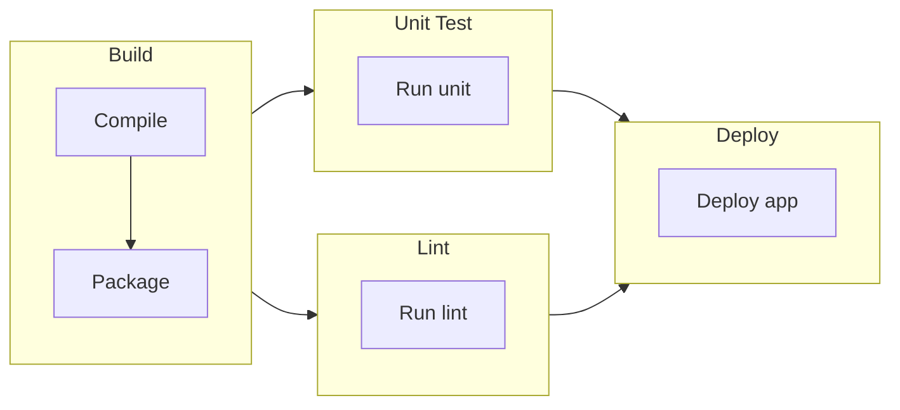

# CLI Reference

This page provides complete documentation for the Probe command-line interface, including all commands, options, and usage patterns.

## Basic Usage

Probe is invoked in one of two forms: a workflow file to run, or a subcommand acting on one.

```bash
probe [options] <workflow-file>
probe <subcommand> [options] <file>
```

## Command Syntax

Every invocation names one or more workflow files. Options come before them, and a subcommand takes their place when you want something other than a run.

### Basic Command

Execute a single workflow file:

```bash
probe workflow.yml
```

### File Merging

Execute workflows with configuration merging:

```bash
probe base.yml,environment.yml,overrides.yml
```

The files are concatenated from left to right into a single YAML document. A top-level key defined in more than one file takes the value from the last file, and the whole key is replaced rather than merged entry by entry.

### Positional Arguments

The workflow path is the only positional argument, and it is required.

#### `workflow-path`

**Type:** String (required)  
**Description:** Path to the workflow YAML file, or comma-separated list of files for merging

**Examples:**
```bash
# Single file
probe workflow.yml

# Multiple files (merging)
probe base.yml,production.yml

# Relative paths
probe ./workflows/api-test.yml

# Absolute paths
probe /home/user/workflows/monitoring.yml
```

## Command-Line Options

The options change how a run reports itself rather than what it does: how much detail is printed, in what format, and whether timings are included.

### `-v, --verbose`

**Type:** Boolean flag  
**Default:** `false`  
**Description:** Enable verbose output showing detailed execution information

**Example:**
```bash
probe -v workflow.yml
probe --verbose workflow.yml
```

**Verbose Output Includes:**
- Step-by-step execution details
- HTTP request/response information
- Template evaluation results
- Timing information
- Debug messages

### `-h, --help`

**Type:** Boolean flag  
**Description:** Show command usage help and exit

**Example:**
```bash
probe -h
probe --help
```

### `--version`

**Type:** Boolean flag
**Description:** Show version information and exit

**Example:**
```bash
probe --version
```

**Output Format:**
```
Probe Version 1.2.3 (commit: abc1234)
```

### `--timing`

**Type:** Boolean flag  
**Default:** `false`  
**Description:** Show timing information (start time and response time) for each step

**Example:**
```bash
probe --timing workflow.yml
```

### `--output`

**Type:** String  
**Values:** `auto`, `spinner`, `stream`  
**Default:** `auto`  
**Description:** Select how the report is rendered. `auto` picks `spinner` on an interactive terminal and `stream` otherwise. `spinner` redraws progress in place, while `stream` writes each result as it completes, which suits CI logs and pipes.

The value can also come from the `PROBE_OUTPUT` environment variable. The flag wins over the environment variable, which in turn wins over auto detection.

**Example:**
```bash
probe --output stream workflow.yml
probe --output=spinner workflow.yml
PROBE_OUTPUT=stream probe workflow.yml
```

### `--report`

**Type:** String  
**Values:** a comma separated list of `format[=path]`, where `format` is `json`, `junit`, `markdown` or `github-summary`  
**Default:** none; no report file is written  
**Description:** Write the result of the run to files once every job has finished. The terminal report is unchanged.

A format without a path is written to its default file in the current directory. Parent directories of a path are created as needed, and each format may be given once. An existing file is replaced and keeps its permissions; a new one gets what the umask allows. A path inside the current directory never leads out of it: a symlink at the file is replaced rather than followed, and a symlink on a directory along the way that points outside is refused, so a checked-out project cannot redirect a report to a file elsewhere. A path outside the current directory, absolute or through `..`, is written where it says.

| Format | Default file | Contents |
|---|---|---|
| `json` | `probe-report.json` | The whole run: status, timings, a summary of jobs and steps by status, and every step with its test, what its response was matched to in an OpenAPI document as `contract`, and, when it failed, the reason and the request and response |
| `junit` | `probe-junit.xml` | JUnit XML with a `testsuite` per job and a `testcase` per step, for CI systems that read test results |
| `markdown` | `probe-report.md` | A summary line, a table of jobs, and a section per failed step |
| `github-summary` | `$GITHUB_STEP_SUMMARY` | The `markdown` page, appended to the GitHub Actions job summary |

`github-summary` appends rather than overwrites, since earlier steps and other tools write to the same summary. Outside GitHub Actions, where `GITHUB_STEP_SUMMARY` is not set and no path is given, it prints a warning and is skipped without changing the exit code, so one command line serves CI and a local run. GitHub accepts at most 1 MiB of summary per step: when the page would go over, the requests and responses are left out, and if it is still too large the page is cut short at a failed step, with a note saying so. If earlier steps have left no room at all, nothing is written and a warning says so, so that the summary they wrote is not lost. Parent directories of an explicit path are created as for the other formats. An explicit path is kept inside the current directory in the same way, refusing any symlink that leads out, since the summary is appended to rather than replaced; the path in `GITHUB_STEP_SUMMARY` is used as given.

A step's status is `passed`, `failed`, `skipped`, or `untested` when it ran without a `test` and nothing else checked it, such as an OpenAPI document. A failed step records one of these reasons:

| Kind | Meaning | JUnit element |
|---|---|---|
| `assertion` | The `test` expression evaluated to false | `<failure>` |
| `test_error` | The `test` expression could not be evaluated | `<error>` |
| `test_type` | The `test` expression did not evaluate to a boolean | `<error>` |
| `action` | The action returned an error, such as a refused connection | `<error>` |
| `template` | A template in the step's `with`, `vars` or `name` could not be evaluated, so the action did not run | `<error>` |
| `contract_response` | The response broke the contract the action checked it against, such as an OpenAPI document | `<failure>` |
| `refused` | The guard of the run, such as `--read-only`, refused what the step was to do | `<error>` |
| `contract_request` | The request broke the contract the action checked it against: the workflow sent what an OpenAPI document does not allow | `<error>` |

A step in a job with `repeat` fails when any iteration fails, and reports how many iterations passed and why the first failing one failed. When an action sets `dump: false` on its response, the request and response are left out of the report as they are left out of the terminal.

The value can also come from the `PROBE_REPORT` environment variable, and the flag wins over it. If a report file cannot be written, the others are still written and Probe exits with status 2.

**Example:**
```bash
probe --report junit workflow.yml
probe --report json=out/report.json,junit=out/junit.xml,markdown=out/summary.md workflow.yml
PROBE_REPORT=markdown probe workflow.yml
```

### `--read-only`

**Type:** Boolean  
**Default:** false  
**Description:** Refuse what writes, so that a workflow, such as one a coding agent wrote, can be run against a system it must not change.

`--read-only`, `--allow-host` and `--allow-action` make up the guard of a run. The guard is set on the command line, or by environment variables, by whoever runs Probe, and nothing in a workflow can loosen it. A step that asks for what the guard does not allow is refused before anything is sent, and fails with the kind `refused`, which exits with status 2. A job run by the `embedded` action runs under the same guard, and a step of it that is refused refuses the step that embeds it. A refused step is not retried.

Each action keeps to the guard as far as it can tell what it is about to do:

| Action | `--read-only` | `--allow-host` |
|---|---|---|
| `http` | Sends only `GET`, `HEAD` and `OPTIONS` | The host of the URL, and of each redirect; a URL without a port is taken at the port of its scheme |
| `db` | Runs one statement that starts with `SELECT`, `SHOW`, `DESCRIBE`, `DESC`, `EXPLAIN` or `WITH` and holds no semicolon but at its end, over a DSN that runs no statement on connecting, in a read-only transaction, or on a SQLite connection that only queries, so that the database refuses a write the statement hides | Each server the driver may connect to, as the driver reads the DSN: for MySQL the address go-sql-driver dials; for PostgreSQL those lib/pq resolves the DSN to, with its parameters, a service file and `PGHOST`, `PGHOSTADDR`, `PGPORT` and the like, every host of a list, and the address of `hostaddr` when it is given; the driver's port when none is named; a SQLite file names no host |
| `embedded` | Runs the job under the guard | Runs the job under the guard |
| `hello` | Nothing to refuse | Nothing to reach |

Any other action, the built-in `shell`, `ssh`, `browser`, `grpc`, `smtp`, `imap` and `mail-latency`, and every external action, cannot be told to keep to the guard, so a step using one is refused under it unless `--allow-action` names the action.

A write that the database itself refuses, such as `WITH x AS (DELETE ...) SELECT ...`, fails as the database reports it rather than as `refused`. The guard keeps a workflow from writing to, or reaching, what it was not meant to; it is not a sandbox.

`--read-only=false` turns it off. The value can also come from the `PROBE_READ_ONLY` environment variable, `true` or `1`, and the flag wins over it whenever it is given.

**Example:**
```bash
probe --read-only --allow-host api.staging.example.com workflow.yml
```

### `--allow-host`

**Type:** String  
**Values:** a comma separated list of hosts: a name or an address, with a port, such as `localhost:8080`, or without one for any port, or `*.example.com` for the names under `example.com`  
**Default:** none; any host  
**Description:** Refuse connecting to any host but these. Names are compared without regard to case. See `--read-only` for which actions keep to it.

The value can also come from the `PROBE_ALLOW_HOSTS` environment variable, and the flag wins over it whenever it is given, so that `--allow-host=` allows any host.

### `--allow-action`

**Type:** String  
**Values:** a comma separated list of action names, as a step writes them in `uses`  
**Default:** none  
**Description:** Run these actions under `--read-only` or `--allow-host` although they do not keep to the guard, such as `shell` for a setup step the person running Probe trusts. They are run as they are without the guard.

The value can also come from the `PROBE_ALLOW_ACTIONS` environment variable, and the flag wins over it whenever it is given, so that `--allow-action=` allows none.

**Example:**
```bash
probe --read-only --allow-action shell workflow.yml
```

## Subcommands

A subcommand replaces the run with something else: `gen` writes a starting workflow, `dag` prints the dependency graph a workflow describes, `check` finds what is wrong or weak in a workflow without running it, `coverage` tells how much of an OpenAPI document a run checked, `guide` prints this documentation, and `skill` sets up a coding agent to use Probe.

### `gen`

Generate probe workflow YAML from an OpenAPI specification.

**Usage:**
```bash
probe gen <openapi-file>
```

**Example:**
```bash
probe gen petstore.yml
```

### `dag`

Display job dependency graph without executing the workflow. By default, outputs ASCII art. Use `--mermaid` to output in Mermaid flowchart format.

**Usage:**
```bash
probe dag <workflow-file>
probe dag --mermaid <workflow-file>
```

**Options:**

| Option | Description |
|--------|-------------|
| `--mermaid` | Output in Mermaid flowchart format instead of ASCII art |

**ASCII Output Example:**
```
╭───────────────────────╮
│         Setup         │
├───────────────────────┤
│ ○ Initialize          │
╰───────────┬───────────╯
            │
            │
            ↓
╭───────────────────────╮
│         Build         │
├───────────────────────┤
│ ○ Compile             │
│ ○ Package             │
╰───────────┬───────────╯
            │
            ├──────────────────────────┐
            ↓                          ↓
╭───────────────────────╮  ╭───────────────────────╮
│        Test A         │  │        Test B         │
├───────────────────────┤  ├───────────────────────┤
│ ○ Run tests           │  │ ○ Run tests           │
╰───────────────────────╯  ╰───────────────────────╯
```

**Mermaid Output Example (`--mermaid`):**

```mermaid
flowchart LR
    subgraph build["Build"]
        direction TB
        build_step0["Compile"]
        build_step1["Package"]
        build_step0 --> build_step1
    end
    subgraph unit_test["Unit Test"]
        direction TB
        unit_test_step0["Run unit"]
    end
    subgraph lint["Lint"]
        direction TB
        lint_step0["Run lint"]
    end
    subgraph deploy["Deploy"]
        direction TB
        deploy_step0["Deploy app"]
    end

    build --> unit_test
    build --> lint
    unit_test --> deploy
    lint --> deploy
```

This is useful for:
- Visualizing workflow structure before execution
- Understanding job dependencies and their steps
- Debugging job dependency configurations
- Generating documentation with rendered diagrams
- Embedding in Markdown files for automatic rendering

### `check`

Find what is wrong or weak in a workflow without running it, so that a workflow written by hand or by a coding agent can be checked before it reaches the systems it tests. Several files read together, as a run reads them, are given as one comma-separated argument.

**Usage:**
```bash
probe check workflow.yml
probe check base.yml,staging.yml
```

**Output Example:**
```
workflow.yml:10: error: job 0 "Users", step 0 "Log in": unknown key "tset"; did you mean "test"?
workflow.yml:14: error: job 0 "Users", step 1 "Read": unknown action "htp"; did you mean "http"?
workflow.yml:18: error: job 0 "Users", step 1 "Read": with: outputs.login.tokn is not published: step "login" publishes token
workflow.yml:39: warning: job 1 "Other", step 0 "Reads users": with: outputs.login.token may not be published yet: job "Other" does not need job "Users", whose step publishes it

3 errors, 1 warning
```

It reports as an **error**:

- a key a workflow, job, step, `retry` or `repeat` does not take, which a run ignores; a key that holds a YAML anchor for the files read after it is not one
- what a run refuses to load, such as a missing `name` or a duplicate id
- an action that is neither built in nor external, and an external action that cannot be parsed
- a key of a step's `with`, or of a job's `defaults`, that the built-in action does not take, which it ignores, such as `bdoy` for `body`; and `defaults` for a name no action has, which apply to no step. Only the keys directly under them are checked, not those of a map such as `headers`; a key that holds a template, an external action and `hello`, which takes any key, are not
- a `needs` that names no job, and `needs` that go round
- a step id a run refuses
- an expression in `test`, `skipif` or `outputs`, or a template in `name`, `with`, `vars` or `echo`, that does not parse
- an output read that no step publishes, that its step does not publish, or that is read before its step publishes it, such as by an earlier step of the job

It reports as a **warning**:

- an output read from a job that is not needed, directly or through others, by the job that reads it, so that it may not be published yet
- a step that nothing checks: it has no `test`, and the action is not asked to check it against a contract, as `openapi` asks the http action and `proto` the grpc action
- a `test` that reads nothing, such as `1 == 1`, which gives the same result whatever the step does

It exits with status 2 when it finds an error, and with 0 when it finds only warnings or nothing.

### `coverage`

Tell which operations and responses of an OpenAPI document, or which methods of a `.proto` file, the steps of a run checked, from the report the run wrote with `--report json`. A step counts when the http action checked its response against the document with `openapi`, or the grpc action checked its call against the file with `proto`, whether the step passed or not.

**Usage:**
```bash
probe --report json workflow.yml
probe coverage openapi.yml probe-report.json
probe coverage proto/users.proto probe-report.json
```

**Output Example:**
```
Coverage of openapi.yml

✓ GET /users/{id} (2 steps)
    ✓ 200 (2 steps)
    - 404
- DELETE /users/{id}
    - 204
✓ GET /items (1 step)
    ✓ default (1 step)

Operations: 2 of 3 checked (66.7%)
Responses:  2 of 4 checked (50.0%)
```

Each operation the document declares is listed with the responses it declares, such as `200`, `2XX` or `default`, marked `✓` when a step's response was matched to it and `-` when none was. A step whose status code the operation does not declare counts for the operation alone. Steps count for the document given when they name it by the same path, written in another way such as `./openapi.yml` too; a report whose steps name none of them is an error that lists those they name. A file ending in `.proto` is taken for the grpc action's contract. It is read on its own, without its imports, and each method of each service it declares is listed, such as `users.v1.UserService/GetUser`. A `.proto` file declares no statuses its methods end with, so its coverage is told by methods alone, without the line for responses. Name the file as `proto.files` does.

It exits with status 0 whatever the coverage, and with 2 when the document or the report cannot be read.

### `guide`

Print a page of the reference and concept documentation as Markdown. The pages are built into the binary, so they work offline and describe the version of Probe that is running. A coding agent can read them before it writes or fixes a workflow.

**Usage:**
```bash
probe guide            # list the topics
probe guide <topic>    # print one page
```

| Topics | Pages |
|---|---|
| `yaml`, `cli`, `functions`, `env`, `actions` | The YAML configuration, the CLI, the built-in functions, the environment variables, and the overview of actions |
| An action name, such as `http` or `shell` | That action's reference. `actions/http` works too |
| `concepts/<name>`, such as `concepts/expressions` or `concepts/testing` | The concept guides |

**Example:**
```bash
probe guide http | less
probe guide concepts/expressions > expressions.md
```

An unknown topic exits with status 2.

### `skill`

Print or install the agent skill that teaches a coding agent, such as Claude Code, to write, run and debug Probe workflows. The skill tells the agent to read `probe guide` before writing YAML, lists the rules that are easy to get wrong, and explains how to read a failed run from its exit code and report.

**Usage:**
```bash
probe skill                    # print SKILL.md
probe skill install            # write .claude/skills/probe/SKILL.md
probe skill install <dir>      # write <dir>/SKILL.md
```

`install` creates the directory and replaces an existing `SKILL.md`, so running it again after upgrading Probe brings the skill up to date. As with report files, a symlink in the project, at `SKILL.md` or on a directory such as `.claude`, cannot make it write outside the project. For an agent that reads skills from another place, give that directory, for example `probe skill install .agents/skills/probe`. The same file is in the repository at `skills/probe/SKILL.md` for tools that install skills from a repository.

## Environment Variables

The following environment variables affect Probe's behavior:

### `PROBE_OUTPUT`

**Type:** String  
**Values:** `auto`, `spinner`, `stream`  
**Default:** `auto`  
**Description:** Report output mode, same as `--output`. The flag takes precedence.

```bash
export PROBE_OUTPUT=stream
probe workflow.yml
```

### `PROBE_REPORT`

**Type:** String  
**Values:** a comma separated list of `format[=path]`  
**Default:** none  
**Description:** Report files to write, same as `--report`. The flag takes precedence.

```bash
export PROBE_REPORT=junit=out/junit.xml
probe workflow.yml
```

### `PROBE_READ_ONLY`, `PROBE_ALLOW_HOSTS`, `PROBE_ALLOW_ACTIONS`

**Description:** The guard of the run, the same as `--read-only`, `--allow-host` and `--allow-action`. `PROBE_READ_ONLY` is `true` or `1` to refuse what writes, and `false`, `0` or empty not to. Each flag takes precedence over its variable.

```bash
export PROBE_READ_ONLY=true
export PROBE_ALLOW_HOSTS=api.staging.example.com
probe workflow.yml
```

### `PROBE_MAX_REPEAT_COUNT`

**Type:** Integer  
**Default:** `10000`  
**Description:** Upper limit for a step's `repeat.count`. A workflow that asks for more is rejected.

```bash
export PROBE_MAX_REPEAT_COUNT=50000
probe load-test.yml
```

### `PROBE_MAX_ATTEMPTS`

**Type:** Integer  
**Default:** `10000`  
**Description:** Upper limit for a step's retry `max_attempts`.

```bash
export PROBE_MAX_ATTEMPTS=100
probe workflow.yml
```

### `FORCE_COLOR`

**Type:** String  
**Values:** `1`  
**Description:** Force colored output even when standard output is not a terminal, such as in a CI log.

```bash
FORCE_COLOR=1 probe workflow.yml
```

Workflows read any other environment variable through `vars`, so `API_URL`, `ENVIRONMENT` and the like are yours to define. See [Environment Variables](/reference/environment-variables) for that side of things.

## Usage Examples

The examples below start from a single file and build up to merged configurations, containers, CI runs and scheduled monitoring.

### Basic Workflow Execution

A run needs nothing but the file, and `-v` adds the detail of each step.

```bash
# Run a simple health check
probe health-check.yml

# Run with verbose output
probe -v health-check.yml
```

### Environment-Specific Execution

Listing a second file after a comma merges it over the first, which is how one workflow targets different environments.

```bash
# Development environment
probe workflow.yml,dev.yml

# Staging environment
probe workflow.yml,staging.yml

# Production environment
probe workflow.yml,prod.yml
```

### Complex Configuration Merging

More than two files can be merged, each one overriding the ones before it.

```bash
# Layer multiple configurations
probe base.yml,region-us.yml,environment-prod.yml,team-overrides.yml
```

### CI/CD Integration

Because the exit status reflects the result, a deployment script can stop on a failed run.

```bash
#!/bin/bash
# deployment-test.sh

set -e

echo "Running deployment validation..."
probe deployment-validation.yml,${ENVIRONMENT}.yml

echo "Running smoke tests..."
probe smoke-tests.yml,${ENVIRONMENT}.yml

echo "All tests passed!"
```

### Scheduled Execution

Running the same workflow on a schedule turns it into monitoring, whether through cron or a systemd timer.

```bash
# Crontab entry for regular monitoring
# Run every 5 minutes
*/5 * * * * /usr/local/bin/probe /opt/workflows/monitoring.yml >> /var/log/probe.log 2>&1

# Systemd timer unit
[Unit]
Description=Probe Monitoring
Requires=probe-monitoring.timer

[Service]
Type=oneshot
ExecStart=/usr/local/bin/probe /opt/workflows/monitoring.yml
User=probe
Group=probe

[Install]
WantedBy=multi-user.target
```

## Exit Codes

The exit code says not only whether a run failed but what has to be looked at, so a caller can tell a bug in the system under test from a target that cannot be reached or a mistake in the workflow.

| Exit Code | Meaning | Description |
|-----------|---------|-------------|
| `0` | Success | Every job completed and every test passed |
| `1` | Test failed | A `test` evaluated to false, could not be evaluated, or did not evaluate to a boolean, a template a step needed could not be evaluated, or a request or response broke the OpenAPI document the http action checked it against |
| `2` | Configuration error | The workflow or the command line is wrong: a missing file, invalid YAML, an unknown `needs`, an invalid step ID, an unknown flag or report format. A step the guard of the run refused, and a report file that cannot be written, also exit `2` |
| `3` | Action error | An action returned an error, such as a refused connection or a timeout, so its test could not be checked |

When a run has more than one kind of failure, the code is the first of `2`, `3`, `1` that applies. A target that is down usually makes the tests against it fail too, so `3` is reported over `1`.

`--help` prints the usage and exits `1`.

### Exit Code Examples

The exit status is what a surrounding script branches on.

```bash
# Branch on what went wrong
probe workflow.yml
case $? in
  0) echo "Workflow succeeded" ;;
  1) echo "A test failed: look at the system under test" ;;
  2) echo "The workflow or command line is wrong" ;;
  3) echo "An action failed: check that the targets are reachable" ;;
esac

# Use in CI/CD pipelines
probe integration-tests.yml || exit 1
```

## Performance and Resource Usage

Probe is a single binary with no runtime to start, so the cost of a run is dominated by what the workflow itself waits on.

### Memory Usage

- **Base memory:** ~10MB for Probe runtime
- **Per workflow:** ~1-5MB depending on complexity
- **Per action:** ~0.1-1MB depending on response size

### Execution Timing

`time` gives the total, and `--timing` breaks it down per step.

```bash
# Time workflow execution
time probe workflow.yml

# Per-step timing
probe --timing workflow.yml
```

### Concurrent Execution

Probe executes jobs in parallel when possible:

```bash
# Jobs without dependencies run concurrently
# Maximum concurrency is typically limited by system resources
# Use verbose mode to see execution pattern
probe -v parallel-workflow.yml
```

## Troubleshooting Commands

When a run does not behave as expected, the first step is to see what Probe actually loaded. The commands below print that, and the issues after them are the ones that come up most often.

### Debug Information

Combining the options prints everything a run knows about itself, and `--version` identifies the binary being used.

```bash
# Maximum detail
probe -v --timing workflow.yml

# Check version and commit
probe --version

# Inspect the job dependency graph without running the workflow
probe dag workflow.yml
```

### Common Issues

**File not found:**
```bash
probe: error: workflow file 'missing.yml' not found
# Check file path and permissions
ls -la missing.yml
```

**Permission denied:**
```bash
probe: error: permission denied reading 'workflow.yml'
# Fix file permissions
chmod 644 workflow.yml
```

**YAML syntax error:**
```bash
probe: error: YAML syntax error at line 15
# Validate YAML syntax
yaml-validator workflow.yml
```

## Integration Examples

Because Probe is one binary and exits with a meaningful status, running it from CI is a single step. The configurations below show that step in three systems.

### GitHub Actions

The binary is installed in one step and the workflow is run in the next.

```yaml
name: Probe Tests
on: [push, pull_request]

jobs:
  test:
    runs-on: ubuntu-latest
    steps:
      - uses: actions/checkout@v3
      
      - name: Install Probe
        run: |
          curl -L https://github.com/linyows/probe/releases/latest/download/probe_linux_x86_64.tar.gz | tar -xz probe
          chmod +x probe
          sudo mv probe /usr/local/bin/
      
      - name: Run Tests
        env:
          API_TOKEN: ${{ secrets.API_TOKEN }}
        run: probe --report github-summary workflow.yml,${GITHUB_REF##*/}.yml
```

`--report github-summary` puts the result, with every failed step, on the run's summary page.

### GitLab CI

The same two steps fit into a single job definition.

```yaml
stages:
  - test

probe-test:
  stage: test
  image: alpine:latest
  before_script:
    - apk add --no-cache curl
    - curl -L https://github.com/linyows/probe/releases/latest/download/probe_linux_x86_64.tar.gz | tar -xz -C /usr/local/bin probe
    - chmod +x /usr/local/bin/probe
  script:
    - probe workflow.yml,$CI_ENVIRONMENT_NAME.yml
  variables:
    API_TOKEN: $API_TOKEN
```

### Jenkins Pipeline

Credentials come from the Jenkins store and reach Probe as environment variables.

```groovy
pipeline {
    agent any
    
    environment {
        API_TOKEN = credentials('api-token')
        PROBE_OUTPUT = 'stream'
    }
    
    stages {
        stage('Install Probe') {
            steps {
                sh '''
                    curl -L https://github.com/linyows/probe/releases/latest/download/probe_linux_x86_64.tar.gz | tar -xz probe
                    chmod +x probe
                    sudo mv probe /usr/local/bin/
                '''
            }
        }
        
        stage('Run Tests') {
            steps {
                sh 'probe workflow.yml,${BRANCH_NAME}.yml'
            }
        }
    }
    
    post {
        always {
            archiveArtifacts artifacts: '*.log', allowEmptyArchive: true
        }
    }
}
```

## Advanced Usage Patterns

The patterns below come from running Probe over many workflows and environments rather than a single file at a time.

### Configuration Templates

The file path itself can be built from the environment, so the command line stays the same across environments.

```bash
# Use environment variables in file paths
export ENV=production
probe workflow.yml,configs/${ENV}.yml

# Dynamic file selection
WORKFLOW_FILE=$([ "$ENV" = "prod" ] && echo "prod-workflow.yml" || echo "dev-workflow.yml")
probe $WORKFLOW_FILE
```

### Batch Execution

A loop over a directory runs every workflow and records which ones failed.

```bash
# Run multiple workflows
for workflow in workflows/*.yml; do
  echo "Running $workflow..."
  probe "$workflow" || echo "Failed: $workflow"
done

# Parallel execution
find workflows/ -name "*.yml" | xargs -P 4 -I {} probe {}
```

### Monitoring Integration

The exit status is what a monitoring system needs, so the result can be forwarded from the surrounding script.

```bash
# Integration with monitoring systems
probe monitoring.yml
RESULT=$?

if [ $RESULT -ne 0 ]; then
  # Send alert to monitoring system
  curl -X POST https://monitoring.example.com/alert \
    -H "Content-Type: application/json" \
    -d '{"message": "Probe workflow failed", "exit_code": '$RESULT'}'
fi
```

## See Also

- **[YAML Configuration](/reference/yaml-configuration)** - Complete YAML syntax reference
- **[Actions Reference](/reference/actions-reference)** - Built-in actions and parameters
- **[Environment Variables](/reference/environment-variables)** - All supported environment variables
- **[How-tos](/guide/how-tos/api-testing)** - Practical usage examples
- **[Error Handling Strategies](/guide/how-tos/error-handling-strategies)** - Common issues and solutions
