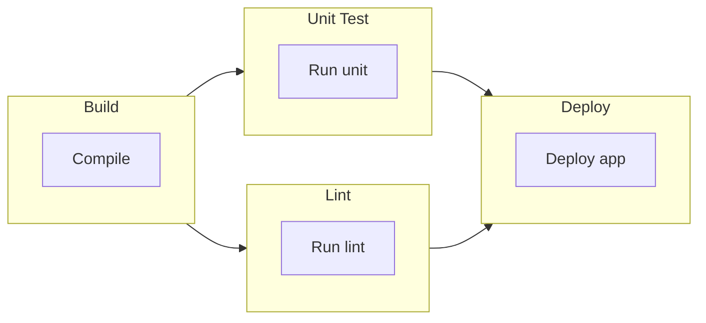

# CLIリファレンス

このページでは、すべてのコマンド、オプション、使用パターンを含む、Probeコマンドラインインターフェイスの完全なドキュメントを提供します。

## 基本的な使用法

```bash
probe [workflow-file] [options]
```

## コマンド構文

### 基本コマンド

単一のワークフローファイルを実行：

```bash
probe workflow.yml
```

### ファイルマージ

設定マージでワークフローを実行：

```bash
probe base.yml,environment.yml,overrides.yml
```

複数のファイルは左から右にマージされ、後のファイルが前のファイルを上書きします。

### 位置引数

#### `workflow-path`

**型:** String（必須）  
**説明:** ワークフローYAMLファイルのパス、またはマージ用のカンマ区切りファイルリスト

**例:**
```bash
# 単一ファイル
probe workflow.yml

# 複数ファイル（マージ）
probe base.yml,production.yml

# 相対パス
probe ./workflows/api-test.yml

# 絶対パス
probe /home/user/workflows/monitoring.yml
```

## コマンドラインオプション

### `-v, --verbose`

**型:** ブールフラグ  
**デフォルト:** `false`  
**説明:** 詳細な実行情報を表示する詳細出力を有効化

**例:**
```bash
probe -v workflow.yml
probe --verbose workflow.yml
```

**詳細出力に含まれる内容:**
- ステップバイステップの実行詳細
- HTTPリクエスト/レスポンス情報
- テンプレート評価結果
- タイミング情報
- デバッグメッセージ

### `-h, --help`

**型:** ブールフラグ  
**説明:** コマンド使用法ヘルプを表示して終了

**例:**
```bash
probe -h
probe --help
```

### `--version`

**型:** ブールフラグ
**説明:** バージョン情報を表示して終了

**例:**
```bash
probe --version
```

**出力形式:**
```
Probe Version 1.2.3
Build: abc1234
Go Version: go1.20.1
```

### `--dag-ascii`

**型:** ブールフラグ
**デフォルト:** `false`
**説明:** ワークフローを実行せずにジョブ依存関係をASCIIアートで表示。ジョブとそのステップをボックス形式で表示します。

**例:**
```bash
probe --dag-ascii workflow.yml
```

**出力例:**
```
╭───────────────────────╮
│         Setup         │
├───────────────────────┤
│ ○ Initialize          │
╰───────────┬───────────╯
            │
            │
            ↓
╭───────────────────────╮
│         Build         │
├───────────────────────┤
│ ○ Compile             │
│ ○ Package             │
╰───────────┬───────────╯
            │
            ├──────────────────────────┐
            ↓                          ↓
╭───────────────────────╮  ╭───────────────────────╮
│        Test A         │  │        Test B         │
├───────────────────────┤  ├───────────────────────┤
│ ○ Run tests           │  │ ○ Run tests           │
╰───────────────────────╯  ╰───────────────────────╯
```

以下の用途に便利です：
- 実行前にワークフロー構造を可視化
- ジョブ依存関係とそのステップの理解
- ジョブ依存関係の設定をデバッグ
- ドキュメントやコミュニケーション

### `--dag-mermaid`

**型:** ブールフラグ
**デフォルト:** `false`
**説明:** ワークフローを実行せずにジョブ依存関係をMermaidフローチャート形式で表示。出力はGitHub、GitLab、Notionなどのマークダウンビューアで直接レンダリングできます。

**例:**
```bash
probe --dag-mermaid workflow.yml
```

**出力例:**


以下の用途に便利です：
- レンダリングされたダイアグラム付きドキュメントの生成
- Wikiやドキュメントでのワークフロー構造の共有
- 自動レンダリング用にMarkdownファイルへの埋め込み
- プレゼンテーション用のビジュアル表現の作成

## 環境変数

以下の環境変数がProbeの動作に影響します：

### `PROBE_CONFIG`

**型:** String  
**説明:** デフォルト設定ファイルのパス  
**デフォルト:** なし

```bash
export PROBE_CONFIG=/etc/probe/default.yml
probe workflow.yml  # デフォルト設定とマージされる
```

### `PROBE_LOG_LEVEL`

**型:** String  
**値:** `debug`, `info`, `warn`, `error`  
**デフォルト:** `info`  
**説明:** ログレベルを設定

```bash
export PROBE_LOG_LEVEL=debug
probe workflow.yml
```

### `PROBE_NO_COLOR`

**型:** Boolean  
**値:** `true`, `false`, `1`, `0`  
**デフォルト:** `false`  
**説明:** カラー出力を無効化

```bash
export PROBE_NO_COLOR=true
probe workflow.yml
```

### `PROBE_TIMEOUT`

**型:** Duration  
**デフォルト:** `300s`  
**説明:** ワークフロー実行のグローバルタイムアウト

```bash
export PROBE_TIMEOUT=600s
probe workflow.yml
```

### `PROBE_PLUGIN_DIR`

**型:** String  
**デフォルト:** `~/.probe/plugins`  
**説明:** カスタムプラグインを含むディレクトリ

```bash
export PROBE_PLUGIN_DIR=/usr/local/lib/probe/plugins
probe workflow.yml
```

## 使用例

### 基本的なワークフロー実行

```bash
# 簡単なヘルスチェックを実行
probe health-check.yml

# 詳細出力で実行
probe -v health-check.yml
```

### 環境固有の実行

```bash
# 開発環境
probe workflow.yml,dev.yml

# ステージング環境
probe workflow.yml,staging.yml

# プロダクション環境
probe workflow.yml,prod.yml
```

### 複雑な設定マージ

```bash
# 複数の設定をレイヤー化
probe base.yml,region-us.yml,environment-prod.yml,team-overrides.yml
```

### CI/CD統合

```bash
#!/bin/bash
# deployment-test.sh

set -e

echo "Running deployment validation..."
probe deployment-validation.yml,${ENVIRONMENT}.yml

echo "Running smoke tests..."
probe smoke-tests.yml,${ENVIRONMENT}.yml

echo "All tests passed!"
```

### Docker統合

```bash
# ProbeをDockerコンテナで実行
docker run --rm -v $(pwd):/workspace \
  -e API_TOKEN=$API_TOKEN \
  probe:latest workflow.yml

# Docker Composeサービス
version: '3.8'
services:
  probe:
    image: probe:latest
    volumes:
      - ./workflows:/workflows
    environment:
      - API_TOKEN
      - ENVIRONMENT=production
    command: /workflows/monitoring.yml,/workflows/production.yml
```

### スケジュール実行

```bash
# 定期監視用のcrontabエントリ
# 5分毎に実行
*/5 * * * * /usr/local/bin/probe /opt/workflows/monitoring.yml >> /var/log/probe.log 2>&1

# systemdタイマーユニット
[Unit]
Description=Probe Monitoring
Requires=probe-monitoring.timer

[Service]
Type=oneshot
ExecStart=/usr/local/bin/probe /opt/workflows/monitoring.yml
User=probe
Group=probe

[Install]
WantedBy=multi-user.target
```

## 終了コード

Probeは実行結果を示すために標準的な終了コードを使用します：

| 終了コード | 意味 | 説明 |
|-----------|---------|-------------|
| `0` | 成功 | すべてのワークフロージョブが正常に完了 |
| `1` | 一般エラー | テスト失敗またはアクションエラーによりワークフローが失敗 |
| `2` | 設定エラー | 無効なYAML構文または設定 |
| `3` | ファイルが見つからない | ワークフローファイルが見つからない |
| `4` | 権限エラー | ファイル読み取りまたは実行の権限不足 |
| `5` | ネットワークエラー | ネットワーク接続の問題 |
| `6` | タイムアウトエラー | ワークフロー実行がタイムアウトを超過 |
| `7` | プラグインエラー | プラグインの読み込みまたは実行が失敗 |

### 終了コードの例

```bash
# スクリプトで終了コードをチェック
probe workflow.yml
if [ $? -eq 0 ]; then
  echo "Workflow succeeded"
else
  echo "Workflow failed with exit code $?"
fi

# CI/CDパイプラインで使用
probe integration-tests.yml || exit 1
```

## 設定ファイル検索順序

Probeは以下の順序で設定ファイルを検索します：

1. **コマンドライン引数**（明示的なファイルパス）
2. **カレントディレクトリ**（`./probe.yml`, `./probe.yaml`）  
3. **ホームディレクトリ**（`~/.probe.yml`, `~/.probe.yaml`）
4. **システムディレクトリ**（`/etc/probe/probe.yml`）
5. **環境変数**（`$PROBE_CONFIG`）

### 検索例

```bash
# Probeは以下の順序で検索します：
# 1. ./my-workflow.yml (コマンドライン)
# 2. ./probe.yml (カレントディレクトリ)
# 3. ~/.probe.yml (ホームディレクトリ)  
# 4. /etc/probe/probe.yml (システム)
# 5. $PROBE_CONFIG (環境変数)

probe my-workflow.yml
```

## パフォーマンスとリソース使用量

### メモリ使用量

- **ベースメモリ:** Probeランタイムで約10MB
- **ワークフローあたり:** 複雑さに応じて約1-5MB
- **アクションあたり:** レスポンスサイズに応じて約0.1-1MB

### 実行タイミング

```bash
# ワークフロー実行時間を計測
time probe workflow.yml

# 詳細モードで詳細なタイミング
probe -v workflow.yml 2>&1 | grep "Execution time"
```

### 並行実行

Probeは可能な場合ジョブを並列実行します：

```bash
# 依存関係のないジョブは同時実行される
# 最大同時実行数は通常システムリソースにより制限される
# 詳細モードで実行パターンを確認
probe -v parallel-workflow.yml
```

## トラブルシューティングコマンド

### デバッグ情報

```bash
# 最大デバッグ出力
PROBE_LOG_LEVEL=debug probe -v workflow.yml

# バージョンとビルド情報を確認
probe --version

# 実行せずにワークフロー構文を検証
probe --dry-run workflow.yml  # (サポートされている場合)
```

### よくある問題

**ファイルが見つからない:**
```bash
probe: error: workflow file 'missing.yml' not found
# ファイルパスと権限をチェック
ls -la missing.yml
```

**権限拒否:**
```bash
probe: error: permission denied reading 'workflow.yml'
# ファイル権限を修正
chmod 644 workflow.yml
```

**YAML構文エラー:**
```bash
probe: error: YAML syntax error at line 15
# YAML構文を検証
yaml-validator workflow.yml
```

## 統合例

### GitHub Actions

```yaml
name: Probe Tests
on: [push, pull_request]

jobs:
  test:
    runs-on: ubuntu-latest
    steps:
      - uses: actions/checkout@v3
      
      - name: Install Probe
        run: |
          curl -L https://github.com/linyows/probe/releases/latest/download/probe-linux-amd64 -o probe
          chmod +x probe
          sudo mv probe /usr/local/bin/
      
      - name: Run Tests
        env:
          API_TOKEN: ${{ secrets.API_TOKEN }}
        run: probe workflow.yml,${GITHUB_REF##*/}.yml
```

### GitLab CI

```yaml
stages:
  - test

probe-test:
  stage: test
  image: alpine:latest
  before_script:
    - apk add --no-cache curl
    - curl -L https://github.com/linyows/probe/releases/latest/download/probe-linux-amd64 -o /usr/local/bin/probe
    - chmod +x /usr/local/bin/probe
  script:
    - probe workflow.yml,$CI_ENVIRONMENT_NAME.yml
  variables:
    API_TOKEN: $API_TOKEN
```

### Jenkinsパイプライン

```groovy
pipeline {
    agent any
    
    environment {
        API_TOKEN = credentials('api-token')
        PROBE_LOG_LEVEL = 'info'
    }
    
    stages {
        stage('Install Probe') {
            steps {
                sh '''
                    curl -L https://github.com/linyows/probe/releases/latest/download/probe-linux-amd64 -o probe
                    chmod +x probe
                    sudo mv probe /usr/local/bin/
                '''
            }
        }
        
        stage('Run Tests') {
            steps {
                sh 'probe workflow.yml,${BRANCH_NAME}.yml'
            }
        }
    }
    
    post {
        always {
            archiveArtifacts artifacts: '*.log', allowEmptyArchive: true
        }
    }
}
```

## 高度な使用パターン

### 設定テンプレート

```bash
# ファイルパスで環境変数を使用
export ENV=production
probe workflow.yml,configs/${ENV}.yml

# 動的ファイル選択
WORKFLOW_FILE=$([ "$ENV" = "prod" ] && echo "prod-workflow.yml" || echo "dev-workflow.yml")
probe $WORKFLOW_FILE
```

### バッチ実行

```bash
# 複数のワークフローを実行
for workflow in workflows/*.yml; do
  echo "Running $workflow..."
  probe "$workflow" || echo "Failed: $workflow"
done

# 並列実行
find workflows/ -name "*.yml" | xargs -P 4 -I {} probe {}
```

### 監視統合

```bash
# 監視システムとの統合
probe monitoring.yml
RESULT=$?

if [ $RESULT -ne 0 ]; then
  # 監視システムにアラートを送信
  curl -X POST https://monitoring.example.com/alert \
    -H "Content-Type: application/json" \
    -d '{"message": "Probe workflow failed", "exit_code": '$RESULT'}'
fi
```

## 関連項目

- **[YAML設定](../yaml-configuration/)** - 完全なYAML構文リファレンス
- **[アクションリファレンス](../actions-reference/)** - 組み込みアクションとパラメータ
- **[環境変数](../environment-variables/)** - サポートされているすべての環境変数
- **[ハウツー](../../how-tos/)** - 実用的な使用例
- **[エラーハンドリング戦略](../../how-tos/error-handling-strategies/)** - よくある問題と解決策